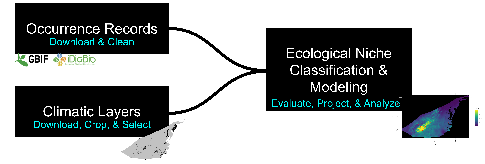

# Ecological Niche Modeling Crash Course
   

**Michelle L. Gaynor**   

🚧 This repository is currently under construction 🚧.  
      
🚧 I am currently updatiing this material 🚧

# Introduction  

From 2017 - 2022, I continuously added to and created new workshop material for the "Using Digitized Collections-Based Data in Research: Applications for Ecology, Phylogenetics, and Biogeography" which the Soltis lab presents at the annual Botany meetings. Here is my current copy of working scripts. You can see the [latest workshop version here](https://github.com/soltislab/BotanyENMWorkshops). 

I ended up creating a pipeline for investigating ecological niche, which I am continuously updating as I learn more. This can be used to address many question. 

Many of the presentations are built upon the work of numerous past Soltis lab members, I list these members below but could be missing many that worked on this material before my time here. Contributions by others are indicated on each script and an incomplete list can be found below. This repository was made in conjunction with iDigBio.

## How to cite    
These scripts have not been published just yet, so if you intend to use them, please cite by linking the repository in your method section as github.com/mgaynor1/ENMCrashCourse. For example "Models were developed for each species following available scripts (github.com/mgaynor1/ENMCrashCourse)." Note, a modification comment is when code is completely rewritten but the general theme is followed. Adding your working directory, looping through multiple taxa, or minor edits to update code to the latest package versions are not modifications that make this work yours, make sure to cite your source! :)

**In-prep publication:**
Patten NN, Gaynor ML, Soltis DE, and Soltis PS. Geographic and Taxonomic Occurrence R-Based Scrubbing (gatoRs): An R package and reproducible workflow for processing biodiversity data. *In prep.*
     
PS. Im currently a PhD student, please feel welcome to reach out if you want to collaborate. 
     
# Overview   
Note: Data Download, Data Cleaning + Georeferencing, Climatic Niche Processing, and Ecological Niche Modeling all have manual activities outside of R. These can all be found in the "Manual/" folder, while all R activities can be found in the "CrashCourse/" folder. 

 

## Setup
If you are new to R-based coding, I suggest you start with [my Biodiversity Literacy in Undergraduate Education (BLUE) module here](http://mlgaynor.com/BLUE-Intro2RwithBiodiversityData/_book/general-information.html). My coding style is a mix of [Data Carpentry](https://datacarpentry.org/) and [tidyverse](https://www.tidyverse.org/learn/), both of which have additional tutorials that can be used to learn this material. 

## 01 - Data Download  
Manual Activity:    
      - https://www.idigbio.org/portal/search

## 02 - Data Cleaning   

Manual Activity:    
      - Gaynor, M. (2020). Cleaning Biodiversity Data: A Botanical Example Using Excel or RStudio. Biodiversity Literacy in Undergraduate Education, QUBES Educational Resources. doi:10.25334/DRGD-F069.

## Georeferencing    
By Blaine Marchant, Charlotte Germain Aubrey, Grant Godden, Andre Naranjo, and Pam Soltis.

Biodiversity databases provide a wealth of occurrence data, which highlight the importance of these collections when investigating distribution of populations and species ranges, conservation planning and biodiversity management, and for classifying the ecological niche of a taxa. Natural History Collections began well before the availability of Global Positioning System (GPS), without exact geographic coordinates, descriptions of collections locality was recorded instead. Currently, iDigBio has 64,176,205 records missing a geopoint, or missing numerical geographic coordinates (5/17/2022). Georeferencing can be utilized to generate geopoints for specimen which currently lack them by converting qualitative locality descriptions into numerical unit.

When converting descriptions into numeric units, uncertainty measurements can be included which allows data to be evaluated with regards to its fitness for research applications and overall data quality. Uncertainty in georeferencing represents the farthest distance the true value could be from the center of the indicated locality. There are many sources of uncertainty including:
 - Coordinate uncertainty
 - Map scale
 - GPS accuracy
 - Unknown datum
 - Imprecision in direction measurements
 - Imprecision in distance measurements
 - Extent of locality

Here we provide specimen records without geopoints and provide instructions for georeferencing.

Additional tutorial:     
	- Sorojsrisom, E., Johnson, M. (2022). Putting specimens on the map: An introduction to georeferencing. BCEENET- Biological Collections in Ecology & Evolution Network, QUBES Educational Resources. doi:10.25334/CBTJ-PV50      
      - [GBIF Georeferencing guide](https://docs.gbif.org/georeferencing-best-practices/1.0/en/#:~:text=In%20georeferencing%2C%20we%20use%20uncertainty,error%20given%20as%20a%20distance.)        

## 03 - Climate Layer Processing    

## 04 - Climatic Niche    

## 05 - Ecological Niche Modeling   

## 06 - ENM Processing    

# Contributions
Contributions are indicated on each script, but to summarize, contributions to these script or presentations have been made by many, including but not limited to: [Natalie Patten](https://github.com/nataliepatten), [Mike Belitz](https://github.com/mbelitz), [Rhett Rautsaw](https://github.com/RhettRautsaw), Maria Cortez, [Andre Naranjo](https://github.com/aanaranjo), [Lauren Whitehurst](https://github.com/laurenwhitehurst21), [Anthony Melton](https://github.com/meltonae), [Johanna Jantzen](https://github.com/jjantzen), Blaine Marchant, Charlotte Germain-Aubrey, Grant Godden, Doug Soltis, and Pam Soltis.     
     
# Additional Resources   
[iDigBio API Working Group](https://biodiversity-specimen-data.github.io/specimen-data-use-case/)     
[QGIS Introduction - RhettRautsaw/GIS_Tutorial](https://github.com/RhettRautsaw/GIS_Tutorial)           
[SDM Best Practices](https://github.com/plantarum/sdm-best-practices/wiki)    
[mbelitz/Odo_SDM_Rproj](https://github.com/mbelitz/Odo_SDM_Rproj)              
[mgaynor1/CURE-FL-Plants](https://github.com/mgaynor1/CURE-FL-Plants)         
[mgaynor1/R4NaturalHistoryCollections-BCEENET2021](https://github.com/mgaynor1/R4NaturalHistoryCollections-BCEENET2021)           
[mgaynor1/long-winded-scripts](https://github.com/mgaynor1/long-winded-scripts)         
[mgaynor1/BLUE-Intro2RwithBiodiversityData](https://github.com/mgaynor1/BLUE-Intro2RwithBiodiversityData)             
[mgaynor1/BCEENET-DataCleaning](https://github.com/mgaynor1/BCEENET-DataCleaning)             
[aemelton/EA_ENA_ENM](https://github.com/aemelton/EA_ENA_ENM)             
[ryanafolk/pno_calc](https://github.com/ryanafolk/pno_calc)             
[ryanafolk/ambitus](https://github.com/ryanafolk/ambitus)           
[ryanafolk/eco-discretizer](https://github.com/ryanafolk/eco-discretizer)           
[richiehodel/Amborella_ENM](https://github.com/richiehodel/Amborella_ENM)         
[jjantzen/CommPhylogeneticsOSBS](https://github.com/jjantzen/CommPhylogeneticsOSBS)       

## Papers to read.        
### Introduction to Natural History Collections    
* Soltis. 2017. Digitization of herbaria enables novel research. American Journal of Botany.     
* Herberling et al. 2019. The changing uses of herbarium data in an era of global change: An overview using automated content analysis. BioScience.      
* Nelson and Ellis. 2018. The history and impact of digitization and digital data mobilization on biodiversity research. Phil. Trans. R. Soc. B.       

### Occurrence Data
* Daru et al. 2017. Widespread sampling biases in herbaria revealed from large-scale digitization. New Phytologist.      
* Zizka et al. 2019. CoordinateCleaner: Standardized cleaning of occurrence records from biological collection databases. Methods in Ecology and Evolution.       
* Aiello-Lammens et al. 2015. spThin: an R package for spatial thinning of species occurrence records for use in ecological niche models. Ecography.              
* Proosdij et al. 2016. Minimum required number of specimen records to develop accurate species distribution models. Ecography.     

       
### Climatic layers      
* Barve et al. 2011. The crucial role of the accessible area in ecological niche modeling and species distribution modeling.  Ecological Modelling.       
* Cobos et al. 2019. An exhaustive analysis of heuristic methods for variable selection in ecological niche modeling and species distribution modeling. Ecological Informatics.        

### ENM methods 
* Peterson. 2001. Predicting species' geographic distributions based on ecological niche modeling. The Condor.    
* Muscarella et al. 2014. ENMeval: An R package for conducting spatially independent evaluations and estimating optimal model complexity for MaxEnt ecological niche models. Methods in Ecology and Evolution.           
* Sillero N. and A. M. Barbosa. 2020. Common mistakes in ecological niche models. International Journal of Geographical Information Science.           
* Jiménez & Soberón. 2020. Leaving the area under the receiving operating characteristic curve behind: An evaluation method for species distribution modelling applications based on presence-only data. Methods in Ecology and Evolution.            
* Cobos et al. 2019. kuenm: an R package for detailed development of ecological niche models using Maxent. PeerJ.           
* Warren et al. 2010. ENMTools: a toolbox for comparative studies of environmental niche models. Ecography.          
* Brown and Carnaval. 2019. A tale of two niche: methods, concepts, and evolution. Frontiers of Biogeography.    
* Warren et al. 2021. The effects of climate change on Australia’s only endemic Pokémon: Measuring bias in species distribution models. Methods in Ecology and Evolution. 
 

### Applications of ENMs
* Allen et al. 2019. Spatial Phylogenetics of Florida Vascular Plants: The Effects of Calibration and Uncertainty on Diversity Estimates. iScience.    
* Marchant et al. 2016. Patterns of abiotic niche shifts in allopolyploids relative to their progenitors. New Phytologist.       
* Gaynor et al. 2018. Climatic niche comparison among ploidal levels in the classic autopolyploid system, Galax urceolata. American Journal of Botany.       
* Visger et al. 2016. Niche divergence between diploid and autotetraploid Tolmiea. American Journal of Botany.         
* Wang et al. 2021. Potential distributional shifts in North America of allelopathic invasive plant species under climate change models. Plant Diversity.       
* Gaynor et al. 2020. Biogeography and ecological niche evolution in Diapensiaceae inferred from phylogenetic analysis. Journal of Systematics and Evolution.       
* Fitzpatrick and Turelli. 2006. The geography of mammalian speciation: Mixed signals from phylogenies and range maps. Evolution.       
* Cardillo and Warren. 2016. Analysing patterns of spatial and niche overlap among species at multiple resolutions. Global Ecology and Biogeography.     
* Jantzen et al. 2019. Effects of taxon sampling and tree reconstruction methods on phylodiversity metrics. Ecology and Evolution.    
  

### ENM vs SDM     
Are Ecological Niche Models (ENMs) and Species Distribution Models (SDMs) the same?   

* [Peterson and Soberon. 2012. Species Distribution Modeling and Ecological Niche Modeling: Getting the concepts right.](https://www.researchgate.net/profile/Jorge-Soberon/publication/255721977_Species_Distribution_Modeling_and_Ecological_Niche_Modeling_Getting_the_Concepts_Right/links/02e7e5358010c83287000000/Species-Distribution-Modeling-and-Ecological-Niche-Modeling-Getting-the-Concepts-Right.pdf)
*  [Franklin. 2012. Mapping Species Distribution.](https://www.cambridge.org/core/books/mapping-species-distributions/58225AE5693AED8BD812F7CEBE35378A)

