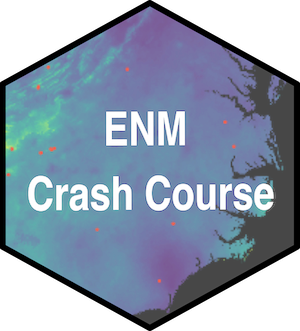

# Ecological Niche Modeling Crash Course
   

**Michelle L. Gaynor**   

🚧 This repository is currently under construction 🚧.  
      
🚧 I am currently updating this material 🚧

# Introduction  

From 2017 - 2022, I continuously added to and created new workshop material for the "Using Digitized Collections-Based Data in Research: Applications for Ecology, Phylogenetics, and Biogeography" workshop which the Soltis lab presents at the annual Botany meetings. Here is my current copy of working scripts, and some extra's that I do not include in the workshop. You can see the [latest workshop version here](https://github.com/soltislab/BotanyENMWorkshops). 

I ended up updating and curating a pipeline for investigating ecological niche, which I am continuously updating as I learn more. This can be used to address many question.   

This material includes: Data Downloading, Data Cleaning, Georeferencing, Climate Layer Processing,  Climatic Niche Analysis, Ecological Niche Modeling, and Ecological Niche Model Processing/Evaluation. [Descriptions are currently being developed on this repositories wiki.](https://github.com/mgaynor1/ENMCrashCourse/wiki)     

Many of the presentations build upon the work of numerous past Soltis lab members, I list these members below but could be missing many that worked on this material before my time here. Contributions by others are indicated on each script and an incomplete list can be found below.  

## How to cite    
These scripts have not been published just yet, so if you intend to use them, please cite by linking the repository in your method section as github.com/mgaynor1/ENMCrashCourse. For example "Models were developed for each species following available scripts (github.com/mgaynor1/ENMCrashCourse)." Note, a modification comment is when code is completely rewritten but the general theme is followed. Adding your working directory, looping through multiple taxa, or minor edits to update code to the latest package versions are not modifications that make this work yours, make sure to cite your source!

**In-prep publication:**
Patten NN, Gaynor ML, Soltis DE, and Soltis PS. Geographic and Taxonomic Occurrence R-Based Scrubbing (gatoRs): An R package and reproducible workflow for processing biodiversity data. *In prep.*
     
     
# Overview   

 

## Setup
If you are new to R-based coding, I suggest you start with [my Biodiversity Literacy in Undergraduate Education (BLUE) module here](http://mlgaynor.com/BLUE-Intro2RwithBiodiversityData/_book/general-information.html). My coding style is a mix of [Data Carpentry](https://datacarpentry.org/) and [tidyverse](https://www.tidyverse.org/learn/), both of which have additional tutorials that can be used to learn this material.  

Note: Data Download, Data Cleaning + Georeferencing, Climatic Niche Processing, and Ecological Niche Modeling all have manual activities outside of R. These can all be found in the "Manual/" folder, while all R activities can be found in the "CrashCourse/" folder.   

# Contributions
Contributions are indicated on each script, but to summarize, contributions to these script or presentations have been made by many, including but not limited to: [Natalie Patten](https://github.com/nataliepatten), [Mike Belitz](https://github.com/mbelitz), [Rhett Rautsaw](https://github.com/RhettRautsaw), Maria Cortez, [Andre Naranjo](https://github.com/aanaranjo), [Lauren Whitehurst](https://github.com/laurenwhitehurst21), [Anthony Melton](https://github.com/meltonae), [Johanna Jantzen](https://github.com/jjantzen), Blaine Marchant, Charlotte Germain-Aubrey, Grant Godden, Doug Soltis, and Pam Soltis.     
     
# More Open-Access Resources   
**[mgaynor1/CURE-FL-Plants](https://github.com/mgaynor1/CURE-FL-Plants)**       
In Spring 2020, I helped teach a Course-based undergraduate research experience at the University of Florida titled 'CURE: Florida Plants and Climate Change'. This class was a 3 credit undergraduate course and it was co-taught with Pam and Doug Soltis. The goal of this research was to look at how climate change would impact the distribution of rare and endangered species currently residing at [Archbold Biological Station](https://www.archbold-station.org/html/lnkpgs/archlistedsp.html). This repository contains demo and project scripts, which are written in a way to loop through a long list of species. Much of these methods are still acceptable, however since this class, I improved this pipeline to defined accessible area with alpha hulls + buffers, rather than convex hulls. I also modified my methods for selecting climatic layers, ecological niche generation, and ecological niche model evaluation. Some of these scripts have also been shortened or simplified by an amazing undergraduate researcher NN Patten.

    
**[mgaynor1/R4NaturalHistoryCollections-BCEENET2021](https://github.com/mgaynor1/R4NaturalHistoryCollections-BCEENET2021)**       
In 2021, I taught a workshop with BCEENET on "Using R for dNHC (Digitized Natural History Collections) Research". This workshop reviews cleaning, mapping, and analyzing natural history collections data in R. It also reviewed point sampling and extracting elevation data from occurrence records, as well as how to run an ANOVA based on this data. 

    
**[mgaynor1/long-winded-scripts](https://github.com/mgaynor1/long-winded-scripts)**       
Over the last few years, I generated many scripts related to using Digitized Natural History Collections data in research. This repository is a collection of some of those scripts, specifically those that took me a large amount of time to put together in R and python. 
- Occurrence Data (R).
      -    This is the first draft of a function that will be part of Natalie's R package gatoRs - this script has since been completely rewritten. 
- SoilGridDownload (python3).
      -   Back when [Max Gebhart](https://github.com/maxg483) was an undergrad at the University of Central Florida, we wanted soil layers included in our ENMs. With the help of Mike Belitz, this code was generated. You can see some of [Max's work here](https://github.com/maxg483/ENM-of-Helianthus). 
- Convex Hulls (R).
      -    This code was generated for a post doc in the Soltis lab who had a question about convex hulls.
- iDigBio Search Bar (R).
      -   Using ridigbio, I wanted to match a simple search from the iDigBio web-portal. This sounds simple, right? Well, it took a long time, but this simple line of code is now avaliable.
       
      
**[mgaynor1/BLUE-Intro2RwithBiodiversityData](https://github.com/mgaynor1/BLUE-Intro2RwithBiodiversityData)**.     
In 2020, I participated in a BIOME Fall Working Group and generated this module. This is an open educational resource which can be cited as followed: Gaynor, M. (2020). Introduction to R with Biodiversity Data. Biodiversity Literacy in Undergraduate Education, QUBES Educational Resources. doi:10.25334/84FC-TE88  

With this material, students will learn R basics while downloading biodiversity data from multiple data repositories. This module will walk students through installing R, navigating R, reproducibility in R, and using R to download biodiversity data.

**[mgaynor1/BCEENET-DataCleaning](https://github.com/mgaynor1/BCEENET-DataCleaning)**              
In Summer 2020, I helped lead a Data Cleaning Workshop led with Pam Soltis for BCEENET. With the help of Molly Philips, this can be cited as an open educational resource: Gaynor, M. (2020). Cleaning Biodiversity Data: A Botanical Example Using Excel or RStudio. Biodiversity Literacy in Undergraduate Education, QUBES Educational Resources. doi:10.25334/DRGD-F069.
      
Upon completion of this module, each student should be able to: (1) Access biodiversity data from open sources. (2) Use descriptive, retrievable, and consistent file names to manage datasets. (3) Identify common problems with digital datasets. (4) Rectify common problems with digital datasets. (5) Apply disciplinary knowledge for smart data cleaning. (6) Explain the importance of reproducible data and cleaning steps. (7) Document data cleaning steps to provide reproducibility.     
     
**[iDigBio API Working Group](https://biodiversity-specimen-data.github.io/specimen-data-use-case/)**   
From 2019 - 2021, I helped host the API Office Hours with Erica Krimmel and Ron Canepa (iDigBio). There are a lot of resources avaliable on this repository, but some of my contributions include:     
- [Round-up of Biodiversity Aggregators](https://biodiversity-specimen-data.github.io/specimen-data-use-case/AggregatorsTable)     
- [Overview of iDigBio's Download API](https://biodiversity-specimen-data.github.io/specimen-data-use-case/Download_API_example)  
- [Demo: Downloading records within a Bounding Box](https://biodiversity-specimen-data.github.io/specimen-data-use-case/BoundingBox.html)  

Ron and Erica also created some great demos/resources. Here are just some of my favorite:     
- [Erica's Demo: Basic Overview of the ridigbio package](https://biodiversity-specimen-data.github.io/specimen-data-use-case/solution/demo_ridigbio_overview.html)
- [Erica's Demo: How to identify specimen records with suspicious coordinate data, using R and iDigBio](https://biodiversity-specimen-data.github.io/specimen-data-use-case/solution/identify-suspicious-coordinate-data.html)
- [David Jennings Demo: Report Metrics for Collections from an Institution](https://biodiversity-specimen-data.github.io/specimen-data-use-case/solution/report-institution-metrics_jsonlite.html)     
- [Erica's Demo: How to find tissue samples using R and iDigBio](https://biodiversity-specimen-data.github.io/specimen-data-use-case/solution/find-tissue-samples_ridigbio.html)     

**[soltislab/BotanyENMWorkshop](https://github.com/soltislab/BotanyENMWorkshops)**    
This repository contains workshop material for "Using Digitized Collections-Based Data in Research: Applications for Ecology, Phylogenetics, and Biogeography" which the Soltis lab presents at the annual Botany meetings. This contains the material used in the 2020 and 2021. Soon this will contain additional material for 2022. This workshop is often done in conjuction with Biotaphy, so this repository contains material outside of the scope of my work and my ENMCrashCourse. As an undergraduate in 2017, I learned all about ENMs with biodiversity occurrence data from Blaine Marchant. When I started as a graduate research assistant with iDigBio in Fall 2018, I started to modify this material to include new methods I was learning. With every additional workshop/course/office-hour I helped lead, I learned something new that I would incoporate into this material. In Spring 2020 and Summer 2021, I heavily revised this material so that it could be used by undergraduate researchers. This summer (2022), I will be revising this pipeline to incorporate Natalie's amazing package and reflect the methods we used to generate ENMs to investigate the impact of climate change on rare and endangered species currently residing at [Archbold Biological Station](https://www.archbold-station.org/html/lnkpgs/archlistedsp.html).    

**Gists**  
Short snibits of code I generated related to using Digitized Natural History Collections data in research.
- [Milton Tan](https://gist.github.com/mgaynor1/86cf5e5d741e3aa8a1a61c52bd667eb7)        
      - Milton wanted to know how to download records with the ridigbio API based on Institution ID and Catelog Number.   
- [spocc_combine loop](https://gist.github.com/mgaynor1/f51b6735afc442f1338f244e6e0f9a9a)     
      - One of my lab mates wanted to know how to use the spocc_combine function (which is an early edition of the gator_download() function) for a list of species. This gist shows how.

# Others Resources
[QGIS Introduction - RhettRautsaw/GIS_Tutorial](https://github.com/RhettRautsaw/GIS_Tutorial)           
[SDM Best Practices](https://github.com/plantarum/sdm-best-practices/wiki)    
[mbelitz/Odo_SDM_Rproj](https://github.com/mbelitz/Odo_SDM_Rproj)              
[aemelton/EA_ENA_ENM](https://github.com/aemelton/EA_ENA_ENM)             
[ryanafolk/pno_calc](https://github.com/ryanafolk/pno_calc)             
[ryanafolk/ambitus](https://github.com/ryanafolk/ambitus)           
[ryanafolk/eco-discretizer](https://github.com/ryanafolk/eco-discretizer)           
[richiehodel/Amborella_ENM](https://github.com/richiehodel/Amborella_ENM)         
[jjantzen/CommPhylogeneticsOSBS](https://github.com/jjantzen/CommPhylogeneticsOSBS)       

